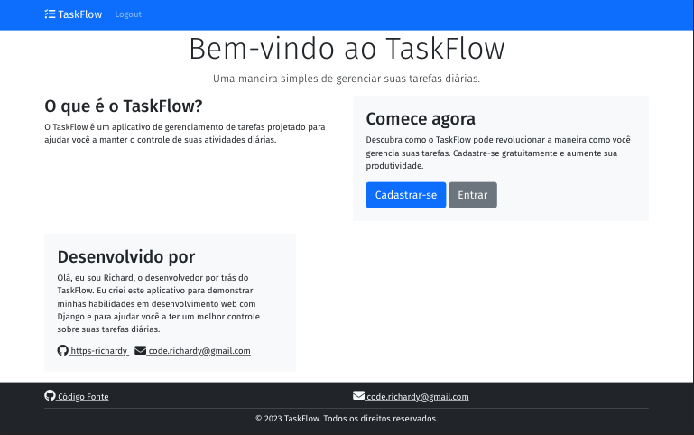
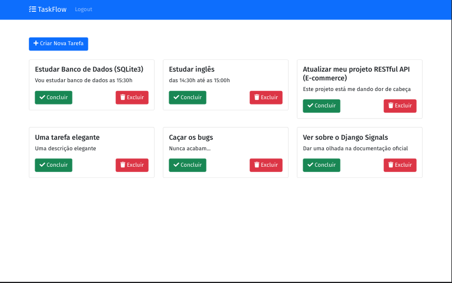
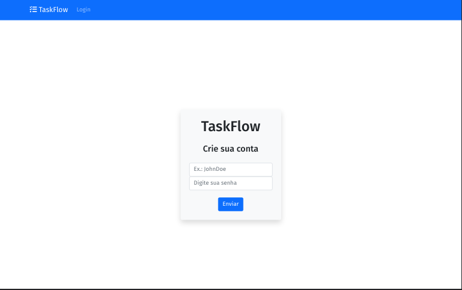

# TaskFlow  

Bem-vindo ao repositório da aplicação **TaskFlow**! Esta é uma demonstração das minhas habilidades de desenvolvimento web, onde utilizei Django, JavaScript, HTML e Bootstrap.

### **Visão Geral**  
TaskFlow é uma aplicação de gerenciamento de tarefas. Com uma interface intuitiva e simples, a aplicação visa facilitar a criação e exclusão de tarefas. (Mais recursos em breve.)


### **Screenshots**


* Pagina inicial


* Dashboard do usuário - Listagem de tarefas.


* Página de criação de contas.


### **Rodando a aplicação localmente**
1. Aplicando as migrações no banco de dados.
```bash
    make migrate
```

2. Rodando a aplicação
```bash
    make run
```
* Uma mensagem como essa deve aparecer:  
    > Watching for file changes with StatReloader  
Performing system checks... 
System check identified no issues (0 silenced).
August 16, 2023 - 15:00:32
Django version 4.2.4, using settings 'core.settings'
Starting development server at http://127.0.0.1:8000/
Quit the server with CONTROL-C.

* Acesse a aplicação abrindo um navegador e acessando o endereço `http://127.0.0.1:8000/` ou `http://localhost:8000/`